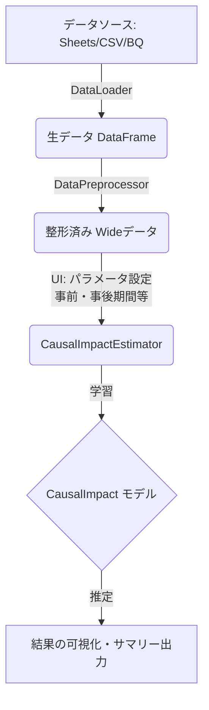
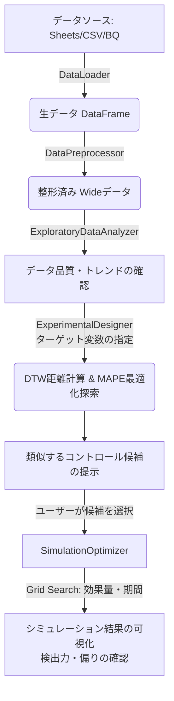

# CausalImpact with Experimental Design 引き継ぎ資料

## 1. 目的と概要 (Overview)
このJupyter Notebook (`CausalImpact_with_Experimental_Design.ipynb`) は、マーケティング施策などの効果検証を行うための**因果推論 (Causal Impact Analysis)** と、その事前準備となる**実験計画 (Experimental Design)** を、ノーコード（UIウィジェット経由）でインタラクティブに実行するためのツールです。

ユーザーはGoogle Colab等の環境でこのNotebookを実行するだけで、UIからデータを読み込み、類似するコントロールグループの選定から、施策効果の推定までを一貫して行うことができます。

## 2. 前提条件と環境 (Prerequisites & Environment)
- **実行環境**: Google Colaboratory (推奨) または Jupyter Notebook環境。
- **主要な依存ライブラリ**:
  - `tfp-causalimpact` (TensorFlow ProbabilityベースのCausalImpact実装)
  - `tslearn` (時系列データのクラスタリング用。※Numbaエラー回避のため `==0.7.0` を指定)
  - `fastdtw` (Dynamic Time Warping距離計算用)
  - `altair` (インタラクティブなグラフ描画用)
  - `ipywidgets` (GUI構築用)
- **外部サービス連携**: Google Cloud (BigQuery), Google Sheetsへの認証 (`google.colab.auth`) を使用してデータをロードします。

## 3. 内部アーキテクチャ (Architecture & Classes)
Notebookは1つの巨大なコードセルにまとめられていますが、内部はオブジェクト指向およびSOLID原則に基づいてクラス分割されています。

### `CausalImpactAnalysis` (Orchestrator)
全体の処理を統括するメインクラス。以下の各コンポーネントを保持し、処理を橋渡しします。
- `load_data()`: `DataLoader` を呼び出し、データを取得。
- `format_data()`: 取得したデータを `DataPreprocessor` に渡し、整形。
- `run_causalImpact()`: 因果推論の処理フロー（UIのパラメータ取得→モデリング→可視化）を実行。
- `run_experimental_design()`: 実験計画の処理フロー（データ品質確認→トレンド確認→コントロール選定）を実行。

### `InteractiveUI`
`ipywidgets` を使ったUIの構築とイベントハンドリングを担当します。
- `generate_ui()`: Notebook上にタブ形式のウィジェットインターフェースを描画。
- `get_params()` / `set_params()`: 現在のUI上の設定値を辞書形式で取得、または一括設定。
- `save_params()` / `load_params()`: 設定値をPickleファイルとして保存/読み込み。

### `DataLoader` (データ読み込み)
`IDataLoader` インターフェースを利用したStrategyパターンを採用。
- `load_data()`: 選択されたデータソース (Sheets, CSV, BigQuery) に応じて、対応する具象クラス (`GoogleSheetLoader`, `CSVLoader`, `BigQueryLoader`) の `load_data()` を呼び出し、`pd.DataFrame` を返します。

### `DataPreprocessor` (データ前処理)
- `format_data()`: 不要カラムの削除、日付列のIndex化、欠損値の補完やサンプリングレートの調整を行います。
- `_shape_wide()`: 縦持ち(Long)データを横持ち(Wide)データへピボット変換します。

### `ExploratoryDataAnalyzer` (探索的データ分析)
- `check_data_quality()`: データの欠損値の有無や期間の範囲を出力します。
- `trend_check()`: `tslearn` (DTW) を用いて時系列クラスタリングを行い、似た動きをする変数をグループ化して可視化します。

### `ExperimentalDesigner` (実験計画)
- `run_design()`: 指定期間のデータを使って、ターゲット変数と相関/連動性の高いコントロール変数を探索します。
- `_calculate_distance()`: 時系列データ間のDTW(Dynamic Time Warping)距離を計算します。
- `_find_similar()`: ターゲットに対する距離が近い変数群を抽出し、MAPE(平均絶対パーセンテージ誤差)が最小になる組み合わせを最適化探索します。

### `SimulationOptimizer` (シミュレーション)
- `generate_simulation()`: 探索されたコントロール群を用いて、因果推論モデルが仮想の施策効果（Lift）を正しく検出できるかシミュレーションします。
- `_execute_simulation()`: 複数の「施策期間」と「効果サイズ(Lift %)」のパターン(Grid Search)でCausalImpactモデルを走らせます。

### `CausalImpactEstimator` (効果検証)
- `create_causalimpact_object()`: `tfp-causalimpact` ライブラリを使用して、状態空間モデル(Structural Time Series)を構築・学習します。
- `plot_causalimpact()`: 推定された因果効果（元の推移、点推定、累積効果）をグラフとして描画します。
- `display_causalimpact_result()`: サマリー統計量（絶対効果、相対効果のp値など）を表示します。

## 3.5. データ処理フロー (Data Flow)

### ① 因果推論 (Causal Impact Analysis) のフロー
実際に施策を行った後、その施策効果（リフト）を推定する流れです。

### ② 実験計画 (Experimental Design) のフロー
施策を行う前に、過去データを用いて最適なコントロール群を見つけ出し、シミュレーションを行う流れです。

## 4. UIと操作手順 (UI Operations)
1. **Data Source (データソース)**:
   - スプレッドシートURL、CSVアップロード、またはBigQueryのプロジェクト/テーブル名を指定してデータを読み込みます。
2. **Data Format (データフォーマット)**:
   - 日付列 (`Date column`)、KPI列、およびピボットが必要な場合はその設定を行い、データを時系列形式に整形します。
3. **Purpose (目的の選択)**:
   - **`experimental_design`**: 過去のデータを用いて、ターゲットと連動して動くコントロール群の探索とシミュレーションを行います。
   - **`causal_impact`**: 実際に施策を実施した後のデータを用いて、その施策がどれだけのインパクトを与えたか（リフト効果）を推定します。

## 5. 運用・保守のポイント (Maintenance)
- **1ファイル構成の維持**:
  - ユーザーが手軽に実行できるよう、複数の `.py` ファイルに分割せず、1つの Notebookファイル (`.ipynb`) 内に全てのクラスを記述しています。
  - そのため、コードの修正や機能追加を行う場合は、Notebook内の該当クラス（例: `DataPreprocessor`）を直接編集します。
- **データソースの拡張**:
  - API連携など新しいデータロード元が必要になった場合は、`IDataLoader` を継承したクラスを新規作成し、`DataLoader` の条件分岐 (`source_index`) に追加するだけで拡張可能です。
- **スタイルガイド**:
  - 今後の保守においても、引数・戻り値の Type Hints と Google Styleの英語Docstring を記述するルールを維持してください。
