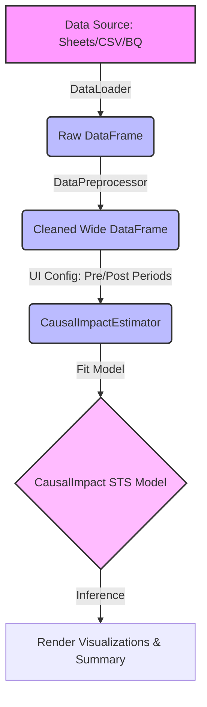
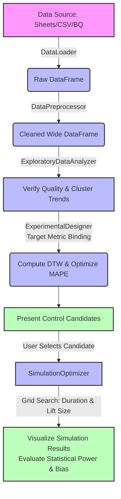

# CausalImpact with Experimental Design

## 1. Overview
This tool (`CausalImpact_with_Experimental_Design.ipynb`) is an all-in-one interactive solution specifically designed for running statistical inference via **Causal Impact Analysis** and preparing pre-campaign setups via **Experimental Design** entirely through a no-code UI widget interface.

Users simply execute the Notebook in Google Colaboratory (or standard Jupyter environments) to import data, identify highly correlated control cohorts, and estimate campaign lift and causal effects seamlessly through the interactive UI.

---

## 2. Prerequisites & Environment

* **Execution Environment**: Google Colaboratory (Recommended) or standard Jupyter Notebook environments.
* **External Integrations**: Authenticates via `google.colab.auth` to load data seamlessly from Google Cloud (BigQuery) and Google Sheets.

### Key Dependencies

| Library | Version / Notes | Purpose |
| :--- | :--- | :--- |
| **`tfp-causalimpact`** | - | TensorFlow Probability-based CausalImpact implementation |
| **`tslearn`** | `==0.7.0` (Pinned) | Time-series clustering (pinned to avoid Numba compilation errors) |
| **`fastdtw`** | - | Dynamic Time Warping (DTW) distance calculation for time series |
| **`altair`** | - | Rendering interactive, declarative data visualizations |
| **`ipywidgets`** | - | Building the graphical user interface (widget layout) |

---

## 3. Architecture & Classes

While the Notebook resides in a single comprehensive code cell for zero-setup execution, the internal architecture strictly follows **Object-Oriented Design** and **SOLID principles**.

```
[UI/UX Layer]         InteractiveUI, UIUtils
      │
[Orchestrator]        CausalImpactAnalysis
      │
[Data Access]         IDataLoader ── (GoogleSheetLoader / CSVLoader / BigQueryLoader)
      │
[Preprocessing]       DataPreprocessor, ExploratoryDataAnalyzer
      │
[Analytical Engines]  ExperimentalDesigner ── SimulationOptimizer ── CausalImpactEstimator
```

### 3.1. UI & Utilities
* **`UIUtils`**: Utility class providing styling tokens and display helpers.
  * `apply_text_style()`: Applies tailored HTML styling (e.g., success, failure indicators) and typography sizing to rendered text.
* **`InteractiveUI`**: Manages the construction of `ipywidgets`, event delegation, and state persistence (Pickle serialization).
  * `__init__()`: Initializes the UI class, sets default sample data URLs, and instantiates all sub-widgets.
  * `_define_widgets()`: Defines and initializes foundational UI controls (text inputs, buttons, sliders).
  * `_define_data_source_widgets()`, `_define_data_format_widgets()`, `_define_experimental_design_widgets()`, `_define_simulation_widgets()`, `_define_date_widgets()`: Constructs specialized widgets for their respective domain configurations.
  * `generate_ui()`: Renders the structured, tab-based user interface within the Notebook output cell.
  * `_build_source_selection_tab()`, `_build_data_type_selection_tab()`, `_build_design_type_tab()`, `_build_purpose_selection_tab()`: Assembles the layout components for each operational tab.
  * `display_simulation_choice()`: Displays candidate control group selections for experimental simulation.
  * `get_params()` / `set_params()`: Extracts all current UI states into a dictionary or populates widgets from a state payload.
  * `download_params()` / `load_params()`: Serializes current configuration to a downloadable Pickle artifact, or restores state from an uploaded file.

### 3.2. Data Loading (`IDataLoader` & Loaders)
Implements the **Strategy Pattern** adhering to SOLID Open/Closed (OCP) and Dependency Inversion (DIP) principles via the `IDataLoader` protocol.

* **`IDataLoader` (Protocol)**
  * `load_data()`: Abstract protocol method for data ingestion.
* **`GoogleSheetLoader`**: Ingests dataset payloads from external Google Sheets URLs.
* **`CSVLoader`**: Parses locally uploaded CSV file streams.
* **`BigQueryLoader`**: Executes SQL queries to load data from BigQuery tables.
* **`DataLoader` (Orchestrator)**
  * `load_data()`: Dynamically instantiates the requested concrete Loader based on configuration parameters and returns the consolidated dataset.

### 3.3. Preprocessing & Exploratory Analysis
* **`DataPreprocessor`**
  * `format_data()`: Cleans raw datasets by dropping unnecessary columns, indexing temporal keys, imputing missing values, and resampling temporal frequencies.
  * `_shape_wide()`: Pivots Long-form raw metrics into Wide-form multidimensional time series.
* **`ExploratoryDataAnalyzer`**
  * `check_data_quality()`: Scans datasets for null values, verifies temporal continuity, and outputs structural summaries.
  * `trend_check()`: Executes time-series clustering using `tslearn` (via DTW) to group and visualize highly correlated metric behaviors over time.

### 3.4. Analytical & Simulation Engines
* **`CausalImpactEstimator` (Causal Inference)**: Wraps `tfp-causalimpact` to execute state-space structural time series modeling.
  * `create_causalimpact_object()`: Constructs and fits Structural Time Series (STS) state-space models incorporating custom pre/post-intervention periods and seasonality.
  * `plot_causalimpact()`: Renders interactive charts showing counterfactual trajectories, pointwise contributions, and cumulative lift.
  * `display_causalimpact_result()`: Outputs detailed summary tables (absolute/relative lift, posterior tail-area probabilities, and confidence intervals).
* **`ExperimentalDesigner` (Cohort Optimization)**
  * `run_design()`: Searches and optimizes historical time series via DTW distances to identify highly correlated control variables for a target metric.
  * `_calculate_distance()`: Computes pairwise Dynamic Time Warping distance matrices across candidate metrics.
  * `_n_part_split()`: Partitions datasets into N balanced subgroups based on historical similarity metrics (used for cross-validation splits).
  * `_find_similar()`: Evaluates candidate subsets to discover variable combinations that minimize Mean Absolute Percentage Error (MAPE) against the target trajectory.
  * `_from_share()` / `_given_assignment()`: Handles share-based control extraction and deterministic variable allocations provided by the user.
  * `visualize_candidate()`: Renders historical alignment comparisons of chosen candidate variables using Altair.
* **`SimulationOptimizer` (Power Simulation)**
  * `__init__()`: Accepts and binds an active `CausalImpactEstimator` instance.
  * `generate_simulation()`: Executes synthetic statistical power simulations to verify if the chosen control cohort can robustly detect hypothetical lift percentages.
  * `_extract_data_from_choice()`: Subsets the dataset according to the user's selected candidate combination.
  * `_execute_simulation()`: Runs grid-search iterations evaluating various "campaign durations" and "lift effect sizes" to assess detection accuracy and bias.
  * `_display_simulation_result()` / `_plot_simulation_result()`: Outputs grid-search success summaries and renders scatter/line charts evaluating precision versus statistical bias.

### 3.5. Main Orchestrator
* **`CausalImpactAnalysis`**
  * The primary orchestration class uniting the system. Bridges interactive UI callbacks with underlying execution steps: data loading, cleaning, executing causal modeling (`run_causalImpact`), running experimental design (`run_experimental_design`), and simulating statistical sensitivity (`generate_simulation`).

---

## 4. Data Flow

### ① Causal Impact Analysis Workflow
The operational pipeline for evaluating post-intervention causal lift after a campaign has run.



### ② Experimental Design Workflow
The pre-campaign preparation pipeline for discovering optimal control groups from historical data and validating sensitivity via synthetic grid simulations.



---

## 5. UI Operations

1. **Data Source Selection**
   * Input a Google Sheets sharing link, upload a local CSV file, or specify a BigQuery project and table identifier.
2. **Data Format Configuration**
   * Designate the temporal index (`Date column`), target KPI column, and pivot/aggregation rules to construct a clean time-series matrix.
3. **Purpose Selection**
   * **`experimental_design`**: Evaluates historical baseline metrics to discover highly correlated control variables and execute statistical sensitivity simulations prior to campaign launch.
   * **`causal_impact`**: Analyzes actual post-intervention data to estimate statistical significance and calculate true campaign lift.

---

## 6. Maintenance

* **Single-File Notebook Strategy**
  * To ensure seamless, zero-dependency execution for end-users, all class definitions are maintained directly within a single interactive Notebook (`.ipynb`) rather than split across separate `.py` modules.
  * When developing new features or refactoring functionality, modify the designated module classes directly inside the Notebook file.
* **Extending Data Loaders**
  * Adding support for new database drivers or APIs simply requires creating a new concrete subclass inheriting from `IDataLoader` and registering it into the selection mapping inside `DataLoader`.
* **Style Guide Enforcement**
  * Maintain clean readability and robust linting by strictly including **Python Type Hints** (arguments and return types) and documenting classes and methods using **Google Style English Docstrings**.
