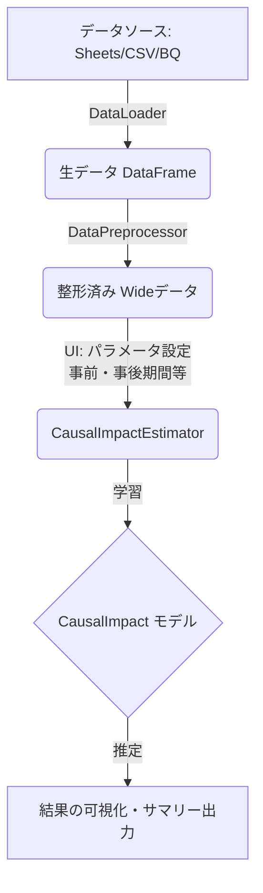
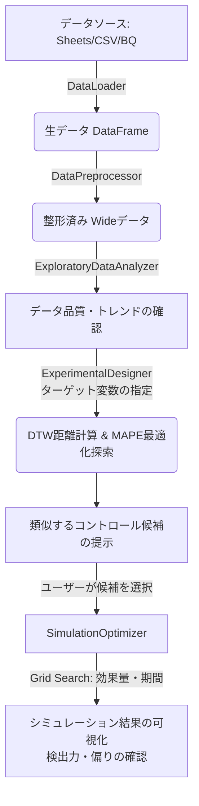

# CausalImpact with experimental design

##### This is not an official Google product.

CausalImpact is a R package for causal inference using Bayesian structural
time-series models. In using CausalImpact, the parallel trend assumption is
needed for counterfactual modeling, so this code performs classification of time
series data based on DTW distances.

## Overview

### What you can do with CausalImpact with experiment design

-   Experimental Design
    -   load time series data from google spreadsheet or csv file
    -   classify time series data so that parallel trend assumptions can be made
    -   simulate the conditions required for verification
-   CausalImpact Analysis
    -   load time series data from google spreadsheet or csv file
    -   CausalImpact Analysis

### Motivation to develop and open the source code

Some marketing practitioners pay attention to
[Causal inference in statistics](https://en.wikipedia.org/wiki/Causal_inference).　However,
using time series data without parallel trend assumptions does not allow for
appropriate analysis. Therefore, the purpose is to enable the implementation and
analysis of interventions after classifying time-series data for which parallel
trend assumptions can be made.

### Typical procedure for use

1. Assume a hypothetical solution to the issue and its factors.
2. Assume room for KPIs and the mechanisms that drive KPIs depending on the solution.
3. In advance, decide next-actions to be taken for each result of hypothesis testing (with/without significant difference).
    - Recommend supporting the mechanism with relevant data other than KPIs
4. Prepare time-series KPI data for at least 100 time points.
    - Regional segmentation is recommended.
    - Previous data, such as the previous year, may make a difference in the market environment.
    - Relevant data must be independent and unaffected by interventions
5. **(Experimental Design)** This tool is used to conduct the experimental design. 
    - Split into groups that are closest to each other where the parallel trend assumption can be placed.
    - Simulation of required timeframe and budget
    - :warning: If the parallel trend assumption cannot be placed, we recommend considering another approach
6. Implemented interventions.
7. Prepare time-series KPI data, including intervention period and assumed residual period, in addition to previous data.
8. **(CausalImpact Analysis)** Conduct CausalImpact analysis.
9. Implement next actions based on results of hypothesis testing

## Note

-   Do not do [HARKing](https://en.wikipedia.org/wiki/HARKing)(hypothesizing after the results are known)
-   Do not do [p-hacking](https://en.wikipedia.org/wiki/Data_dredging)

## Getting started

1.  Prepare the time series data on spreadsheet or csv file
2.  Open ipynb file with **[Open in Colab](https://colab.research.google.com/github/google/business_intelligence_group/blob/main/solutions/causal-impact/CausalImpact_with_Experimental_Design.ipynb)** Button.
3.  Run cells in sequence

## Tutorial
#### CausalImpact Analysis Section

1. Press the **Connect** button to connect to the runtime

2. Run **Step 1** cell. Step 1 cells take a little longer because they install the [tfcausalImpact library](https://github.com/WillianFuks/tfcausalimpact). If you do so, you will see some selections in the Step 1 cell.

3. In question 1, choose **CausalImpact Analysis** and update period before the intervention(**Pre Start & Pre End**) and the period during the intervention(**Post Start and Post End**). 
    

4. In question 2, please select the data source from **google_spreadsheet**, **CSV_file**, or **Big_Query**. 
    Then enter the required items. 
    

5. After entering the required items, the data format will be selected. For CausalImpact analysis, please prepare the data in **wide format** in advance. 
    After selecting wide format, enter the **date column name**. 
    

6. Once the items are filled in, run the **Step 2** cell.  
    (:warning: If you have selected **google_spreadsheet** or **big_query**, a pop-up will appear regarding granting permission, so please grant it to Colab.) 
    
7. After Step 2 is executed, you will see **the results of CausalImpact Analysis**.
    

#### Experimental Design Section

1. Press the **Connect** button to connect to the runtime

2. Run **Step 1** cell. Step 1 cells take a little longer because they install the [tfcausalImpact library](https://github.com/WillianFuks/tfcausalimpact). If you do so, you will see some selections in the Step 1 cell.

3. In question 1, choose **Experimental Design** and update the term(**Start Date & End Date**) to be used in the Experimental Design.
    

4. After updating the term, select the **type of Experimental Design** and update the required items. 
    * A: divide_equally divides the time series data into n groups with similar movements.
    * B: similarity_selection extracts n groups that move similarly to a particular column.

    
    
5. After updating required items, enter the estimated incremental CPA.
    

6. In question 2, please select the data source from **google_spreadsheet**, **CSV_file**, or **Big_Query**. 
    Then enter the required items. 
    

6. After entering the required items, select data format [**narrow_format** or **wide_format**](https://en.wikipedia.org/wiki/Wide_and_narrow_data) and enter the required fields.
    

7. Once the items are filled in, run the **Step 2** cell.  
    (:warning: If you have selected **google_spreadsheet** or **big_query**, a pop-up will appear regarding granting permission, so please grant it to Colab.) 

8. The output results will vary depending on the type of experimental design, but select the data on which you want to run the simulation.

9. Once the items are filled in, run the **Step 3** cell. Depending on the data, this may take more than 10 minutes. 
    After Step 3 is run, the results are displayed in a table. Check the MAPE, budget and p-value, and consider the intervention period and the assumed increments to experimental design.
    
    
10. run the **Step 4** cell.  
    

## Architecture & Maintenance (引き継ぎ・アーキテクチャ資料)

## 3. 内部アーキテクチャ (Architecture & Classes)
Notebookは1つの巨大なコードセルにまとめられていますが、内部はオブジェクト指向およびSOLID原則に基づいてクラス分割されています。以下に定義されているすべてのクラスとそれに含まれるメソッドを説明します。

### `UIUtils`
UIのスタイリングやヘルパー関数を提供するユーティリティクラス。
- `apply_text_style()`: 指定されたタイプ(success/failure等)やフォントサイズに基づいてテキストにスタイルを適用・出力します。

### `InteractiveUI`
`ipywidgets` を使ったUIの構築とイベントハンドリングを担当します。設定パラメータの保存(pickle)・読み込みも行います。
- `__init__()`: UIクラスの初期化、サンプルデータのURL設定、全ウィジェットのインスタンス化を呼び出します。
- `_define_widgets()`: テキストボックスやボタンなど、すべてのウィジェットを定義・初期化します。
- `_define_data_source_widgets()`: データソース選択に関するウィジェットを定義します。
- `_define_data_format_widgets()`: データフォーマット設定に関するウィジェットを定義します。
- `_define_experimental_design_widgets()`: 実験計画に関するウィジェットを定義します。
- `_define_simulation_widgets()`: シミュレーションに関するウィジェットを定義します。
- `_define_date_widgets()`: 日付選択に関するウィジェットを定義します。
- `generate_ui()`: Notebook上にタブ形式のウィジェットインターフェース（全体のレイアウト）を描画します。
- `_build_source_selection_tab()`: データソースタブのレイアウトを構築します。
- `_build_data_type_selection_tab()`: データフォーマットタブのレイアウトを構築します。
- `_build_design_type_tab()`: 実験デザインタブのレイアウトを構築します。
- `_build_purpose_selection_tab()`: 目的選択（因果推論/実験計画）タブのレイアウトを構築します。
- `display_simulation_choice()`: 実験計画の候補選択ウィジェットを表示します。
- `get_params()`: 現在のUI上のすべての設定値を辞書形式で取得します。
- `set_params()`: 辞書データを受け取り、UIウィジェットの値を一括設定します。
- `download_params()`: 現在の設定値をPickleファイルとしてダウンロードします。
- `load_params()`: アップロードされたPickleファイルから設定値を読み込み、UIに反映します。

### データ読み込み機能 (`IDataLoader` / 各種Loader)
`IDataLoader` インターフェースを利用したStrategyパターンを採用し、SOLIDのOCP/DIP原則に準拠しています。

- **`IDataLoader` (Protocol)**
  - `load_data()`: データ読み込みのプロトコルメソッド。
- **`GoogleSheetLoader`**
  - `__init__()` / `load_data()`: Google Sheetsからデータをロードします。
- **`CSVLoader`**
  - `__init__()` / `load_data()`: アップロードされたCSVからデータをロードします。
- **`BigQueryLoader`**
  - `__init__()` / `load_data()`: BigQueryからデータをロードします。
- **`DataLoader` (Orchestrator)**
  - `load_data()`: パラメータに応じて適切なLoader（GoogleSheet, CSV, BigQuery）を選択し、データを取得・返却します。

### `DataPreprocessor` (データ前処理)
- `format_data()`: 不要カラムの削除、日付列のIndex化、欠損値の補完やサンプリングレートの調整など、生データを分析に適した形式へ整形します。
- `_shape_wide()`: 縦持ち(Long)データを横持ち(Wide)データへピボット変換（集計処理）します。

### `ExploratoryDataAnalyzer` (探索的データ分析)
- `check_data_quality()`: データセット内の欠損値の有無や、日付期間の範囲を出力・確認します。
- `trend_check()`: `tslearn` (DTW) を用いて時系列クラスタリングを行い、似た動きをする変数をグループ化して可視化（トレンド・移動平均含む）します。

### `CausalImpactEstimator` (効果検証)
`tfp-causalimpact` をラップし、因果推論のモデリングを行います。
- `create_causalimpact_object()`: 事前・事後期間や季節性を設定し、状態空間モデル(Structural Time Series)を構築・学習します。
- `plot_causalimpact()`: 推定された因果効果（元の推移、点推定、累積効果など）をグラフとして描画します。
- `display_causalimpact_result()`: サマリー統計量（絶対効果、相対効果のp値、信頼区間など）を表示します。

### `ExperimentalDesigner` (実験計画)
- `run_design()`: 過去のデータとDTW距離計算を用いて、ターゲット変数と相関/連動性の高いコントロール変数を探索・最適化します。
- `_calculate_distance()`: 複数時系列データ間のDTW(Dynamic Time Warping)距離を総当たりで計算します。
- `_n_part_split()`: データ群をN分割し、各グループの合計値が互いに似た動きになるように距離ベースで最適化します（分割検証用）。
- `_find_similar()`: ターゲットに対する距離が近い変数群を抽出し、MAPE(平均絶対パーセンテージ誤差)が最小になる組み合わせ（ランダムサンプリングと全探索の組み合わせ）を最適化探索します。
- `_from_share()`: （シェアや割合を用いた）コントロール変数の選定を行います。
- `_given_assignment()`: ユーザーから指定されたターゲット・コントロール変数がある場合の割り当て処理を行います。
- `visualize_candidate()`: 探索されたコントロール候補の過去の推移（ターゲットとの連動性）をAltairで可視化します。

### `SimulationOptimizer` (シミュレーション)
- `__init__()`: `CausalImpactEstimator` のインスタンスを受け取り、初期化します。
- `generate_simulation()`: 探索されたコントロール群を用いて、因果推論モデルが仮想の施策効果（Lift）を正しく検出できるかシミュレーションを実行します。
- `_extract_data_from_choice()`: ユーザーが選択したコントロール候補の組み合わせデータを抽出します。
- `_execute_simulation()`: 複数の「施策期間」と「効果サイズ(Lift %)」のパターン(Grid Search)でCausalImpactモデルを走らせ、推定結果（精度、偏り）を取得します。
- `_display_simulation_result()`: シミュレーション結果のサマリー（Gridごとの検出可否）を出力します。
- `_plot_simulation_result()`: シミュレーション結果の各GridをScatter PlotとLine Chartで可視化し、バイアスと精度のバランスを確認します。

### `CausalImpactAnalysis` (Orchestrator)
全体の処理を統括するメインクラス。以下の各コンポーネントを保持し、ユーザーのボタンクリック等に応じた処理を橋渡しします。
- `__init__()`: UI, DataLoader, DataPreprocessor等のすべてのサブシステムインスタンスを初期化し、ボタンにコールバック関数を登録します。
- `load_data()`: UIウィジェットからのパラメータを元にデータを取得します。
- `format_data()`: 取得したデータを整形・クレンジングします。
- `run_causalImpact()`: 因果推論の処理フロー（モデリング→可視化→サマリー表示）を実行します。
- `display_causalimpact_result()`: 因果推論の結果表示処理を呼び出します。
- `run_experimental_design()`: 実験計画の処理フロー（データ品質確認→トレンド確認→コントロール探索）を実行します。
- `generate_simulation()`: 実験計画後のシミュレーション（Grid Search）を実行します。

## 3.5. データ処理フロー (Data Flow)

### ① 因果推論 (Causal Impact Analysis) のフロー
実際に施策を行った後、その施策効果（リフト）を推定する流れです。

### ② 実験計画 (Experimental Design) のフロー
施策を行う前に、過去データを用いて最適なコントロール群を見つけ出し、シミュレーションを行う流れです。

## 4. UIと操作手順 (UI Operations)
1. **Data Source (データソース)**:
   - スプレッドシートURL、CSVアップロード、またはBigQueryのプロジェクト/テーブル名を指定してデータを読み込みます。
2. **Data Format (データフォーマット)**:
   - 日付列 (`Date column`)、KPI列、およびピボットが必要な場合はその設定を行い、データを時系列形式に整形します。
3. **Purpose (目的の選択)**:
   - **`experimental_design`**: 過去のデータを用いて、ターゲットと連動して動くコントロール群の探索とシミュレーションを行います。
   - **`causal_impact`**: 実際に施策を実施した後のデータを用いて、その施策がどれだけのインパクトを与えたか（リフト効果）を推定します。

## 5. 運用・保守のポイント (Maintenance)
- **1ファイル構成の維持**:
  - ユーザーが手軽に実行できるよう、複数の `.py` ファイルに分割せず、1つの Notebookファイル (`.ipynb`) 内に全てのクラスを記述しています。
  - そのため、コードの修正や機能追加を行う場合は、Notebook内の該当クラス（例: `DataPreprocessor`）を直接編集します。
- **データソースの拡張**:
  - API連携など新しいデータロード元が必要になった場合は、`IDataLoader` を継承したクラスを新規作成し、`DataLoader` の条件分岐 (`source_index`) に追加するだけで拡張可能です。
- **スタイルガイド**:
  - 今後の保守においても、引数・戻り値の Type Hints と Google Styleの英語Docstring を記述するルールを維持してください。
